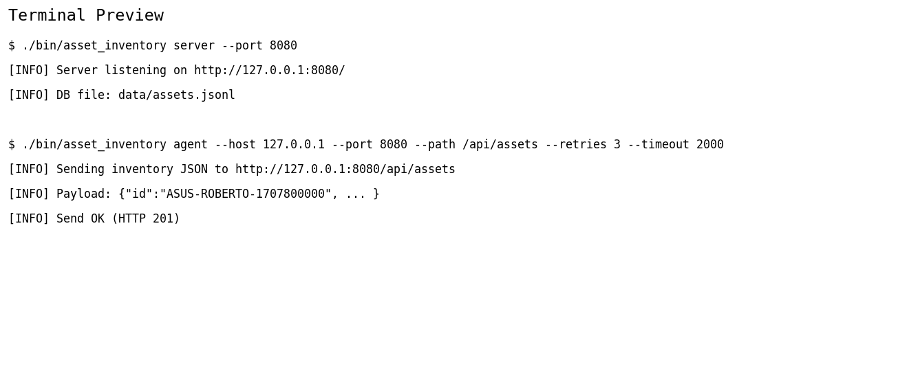
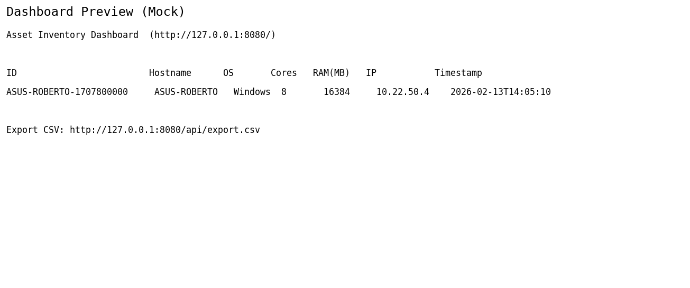

<div align="center">
  
  
  <br/>
  
</div>

---

## Deskripsi
## **Asset Inventory Agent** adalah proyek **C++ (C++17)** yang berisi **agent CLI + server HTTP lokal** untuk membaca informasi perangkat (hostname, OS, CPU core, RAM, IP), menormalkan field, mengirim **JSON** via HTTP, lalu menampilkan **dashboard list aset** dan opsi **export CSV**.
## Manfaat: memudahkan **audit** perangkat, **tracking aset** (inventory), dan **monitoring** sederhana untuk kebutuhan IT Generalist.

---

## Bahasa & Tools
- ✅ **C++17**
- ✅ **Windows + MSYS2 (UCRT64 disarankan)**
- ✅ **make + g++ (MinGW-w64)**
- ✅ **WS2_32** (Windows socket)

---

## Instalasi & Persiapan
## Jalankan perintah ini di **MSYS2 UCRT64** (bukan PowerShell) untuk install toolchain.

---

## Install Toolchain (MSYS2 UCRT64)
```bash
pacman -Syu
pacman -S --needed mingw-w64-ucrt-x86_64-gcc mingw-w64-ucrt-x86_64-make
```

---

## Cek Berhasil
```bash
g++ --version
make --version
```

---

## Proyek Full (ZIP)
## Jika kamu punya file ZIP proyek ini, lakukan extract ke folder, misalnya:
- **Windows**: `C:\Users\ASUS\Desktop\proyek\cpp_asset_inventory_agent_easy`

---

## Build Proyek
## Jalankan build di **MSYS2 UCRT64**:

```bash
cd /c/Users/ASUS/Desktop/proyek/cpp_asset_inventory_agent_easy
make
```

---

## Cara Menjalankan Proyek
## Jalankan **server dulu**, baru jalankan **agent**.

---

## 1) Jalankan Server (Tab/Terminal 1)
```bash
cd /c/Users/ASUS/Desktop/proyek/cpp_asset_inventory_agent_easy
./bin/asset_inventory.exe server --port 8080
```

---

## 2) Kirim Data dari Agent (Tab/Terminal 2)

---

## Opsi A (Disarankan) – Jalankan Agent dari PowerShell
## Ini menghindari masalah konversi path MSYS2.

```powershell
cd C:\Users\ASUS\Desktop\proyek\cpp_asset_inventory_agent_easy
.\bin\asset_inventory.exe agent --host 127.0.0.1 --port 8080 --path /api/assets --retries 3 --timeout 2000
```

---

## Opsi B – Jalankan Agent dari MSYS2 (Anti “/api/assets” berubah jadi C:/msys64/...)
## MSYS2 kadang mengubah argumen yang diawali `/` menjadi path Windows. Pakai salah satu cara ini.

---

## Cara B1 (Paling Aman) – Matikan Konversi Argumen untuk `--path`
```bash
cd /c/Users/ASUS/Desktop/proyek/cpp_asset_inventory_agent_easy
MSYS2_ARG_CONV_EXCL="--path=" ./bin/asset_inventory.exe agent --host 127.0.0.1 --port 8080 --path /api/assets --retries 3 --timeout 2000
```

---

## Cara B2 (Alternatif) – Pakai Path Tanpa Leading Slash
```bash
cd /c/Users/ASUS/Desktop/proyek/cpp_asset_inventory_agent_easy
./bin/asset_inventory.exe agent --host 127.0.0.1 --port 8080 --path api/assets --retries 3 --timeout 2000
```

---

## Di Server Mana Dashboard-nya?
## Setelah server jalan, buka browser:

- ✅ `http://127.0.0.1:8080/` (Dashboard list aset)
- ✅ `http://127.0.0.1:8080/api/assets` (API JSON list aset)
- ✅ `http://127.0.0.1:8080/api/export.csv` (Export CSV)

---

## Cara Cek Output Paling Mudah (Windows PowerShell)
## Di PowerShell, `curl` adalah alias `Invoke-WebRequest`, jadi gunakan **curl.exe**:

```powershell
curl.exe -i "http://127.0.0.1:8080/api/assets"
```

---

## Preview
## Taruh file preview di folder `assets/` supaya README bisa menampilkannya.

```text
assets/
├─ terminal_preview.png
├─ dashboard_preview.png
└─ sample_payload.json
```

---

## Preview Terminal


---

## Preview Dashboard


---

## Contoh JSON yang Dikirim Agent
```json
{
  "id": "ROBERTO-1770968461256",
  "hostname": "ROBERTO",
  "os": "Windows",
  "cpu_cores": 8,
  "ram_mb": 7883,
  "ip": "N/A",
  "timestamp": "2026-02-13T14:41:01"
}
```

---

## Struktur Proyek
```text
cpp_asset_inventory_agent_easy/
├─ README.md
├─ Makefile
├─ src/
│  └─ main.cpp
├─ bin/
│  └─ asset_inventory.exe
└─ assets/
   ├─ terminal_preview.png
   ├─ dashboard_preview.png
   └─ sample_payload.json
```

---

## Troubleshooting
- ✅ **Agent HTTP 404 / URL jadi `http://127.0.0.1:8080C:/msys64/api/assets`**
  - Jalankan agent dari **PowerShell** (Opsi A), atau pakai `MSYS2_ARG_CONV_EXCL="--path="` (Opsi B1).
- ✅ **PowerShell minta “Uri:” saat pakai `curl -i`**
  - Gunakan `curl.exe -i "http://127.0.0.1:8080/api/assets"`.
- ✅ **TCP connect gagal (Test-NetConnection port 8080 false)**
  - Pastikan **server** sudah berjalan dan tidak crash, lalu cek lagi.
- ✅ **Port 8080 dipakai aplikasi lain**
  - Jalankan server di port lain, contoh `--port 9090`, lalu agent ikut ganti `--port 9090`.
- ✅ **Exit Code 1 dari agent**
  - Biasanya karena **gagal kirim** (server belum jalan / path salah / port salah). Cek ulang urutan: **server → agent → curl**.
